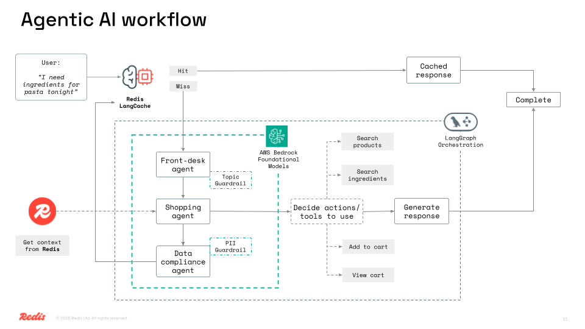

# 🛒 Redish

**Redis-powered grocery e-commerce with intelligent shopping assistance.**

Redish is an AI-powered grocery shopping platform that combines Redis's speed with LangGraph's intelligent workflow orchestration. Get personalized recipe recommendations, smart product suggestions, and lightning-fast responses through semantic caching.

## App screenshots


---

## Product Features

- **Smart Grocery Shopping**: AI-powered assistant helps you find ingredients, discover recipes, and manage your cart
- **Product Search**: Both text and vector-based search across grocery products with embeddings
- **Recipe Intelligence**: Get ingredient lists with suggested products for any recipe
- **Cart Management**: Add, view, and manage shopping cart items

---

## Tech Stack

- **Node.js** + **Express** (Backend API)
- **Redis** (Product store, conversational history, and semantic caching with Redis LangCache)
- **LangGraph** (AI workflow orchestration)
- **AWS Bedrock** (Claude 3.5 Sonnet for conversational AI + Titan Text Embeddings V2 for vector search)
- **HTML + CSS + Vanilla JS** (Frontend)

---

## Getting Started

### Prerequisites

**Required:**
- **AWS Bedrock** (for LLM and embeddings): [Set up AWS credentials](https://docs.aws.amazon.com/bedrock/latest/userguide/getting-started.html)

**Required:**
- **Redis LangCache API**: [Get LangCache credentials](https://redis.io/langcache/)

### Clone this repository

```bash
git clone https://github.com/redis-developer/Redish.git
cd Redish
```

### Configure environment variables

Create a `.env` file at the root:

```bash
APP_NAME="Redish"
SERVER_PORT=3000

# LLM Provider Configuration

# AWS Bedrock Configuration (required for LLM and embeddings)
BEDROCK_AWS_ACCESS_KEY_ID=your_aws_access_key_id
BEDROCK_AWS_SECRET_ACCESS_KEY=your_aws_secret_access_key
BEDROCK_AWS_REGION=us-east-1
BEDROCK_MODEL_ID="anthropic.claude-3-5-sonnet-20241022-v2:0"

# Bedrock Guardrails Configuration (optional - for content safety)
BEDROCK_CONVERSATION_GUARDRAIL_ID=4icw4uthyebe
BEDROCK_CACHE_GUARDRAIL_ID=g7t10xfo69kp
BEDROCK_GUARDRAIL_VERSION=1

# Redis Configuration
REDIS_URL=your_redis_connection_string

# Redis LangCache Configuration (for semantic caching)
LANGCACHE_API_KEY="your_langcache_api_key"
LANGCACHE_API_BASE_URL="your_langcache_api_base_url"
LANGCACHE_CACHE_ID="your_langcache_cache_id"

# For tracing with Langsmith (optional)
LANGSMITH_TRACING="true"
LANGSMITH_ENDPOINT="your_langsmith_endpoint"
LANGSMITH_API_KEY="your_langsmith_api_key"
LANGSMITH_PROJECT="your_langsmith_project"

```

📝 Make sure to replace these placeholders with your real values before running the app.

### Option 1: Manual installation

#### ✅ Prerequisites

- **Node.js (v18 or higher)**: [Download & Install Node.js](https://nodejs.org/)
- **Redis**: You can either:
  - Install Redis locally: [Redis installation guide](https://redis.io/docs/getting-started/installation/)
  - Use Docker: `docker run --name redish-redis -p 6379:6379 redis:8.0`
  - Use [Redis Cloud](https://redis.io) (no installation required)

#### ✅ Setup

1. Install dependencies:
   ```bash
   npm install
   ```

2. Load sample grocery data:
   ```bash
   # Load products (incremental - adds to existing data)
   npm run load-products

   # Fresh start (drops existing index and data)
   npm run load-products -- --drop

   # Custom parameters with fresh start
   npm run load-products -- --drop products.csv 100 2000
   ```

3. Start the server:
   ```bash
   npm start
   ```

### Option 2: 🐳 Run with Docker Compose

Skip manual setup and run everything using Docker:

```bash
docker compose up
```

To stop the containers:

```bash
docker compose down -v
```

### Access the app

Visit http://localhost:3000 in your browser (or use the port specified in `.env`).

---

## AI Features

- **Recipe Ingredients**: Ask for ingredients for any recipe and get suggested products
- **Product Search**: Find products by name, category, or description
- **Smart Recommendations**: AI suggests alternatives and complementary items
- **Cart Management**: Add, remove, and view cart items through natural conversation

## Technical features

- **Semantic Cache**: Similar queries return instantly using Redis LangCache
- **Vector Search**: Find products using AI-powered similarity search
- **Redis as memory layer**: for fast data retrieval
- **LangGraph Workflows**:  AI agent routing, tool selection
- **Multi-tool Agent**: Recipe tools, search tools, cart tools, and knowledge tools

---

## Architecture

The grocery agent uses a LangGraph-powered AI agent that routes requests through specialized tools.

1. **Cache Check**: First checks Redis semantic cache for similar queries
2. **AI Agent**: Routes to appropriate tools based on request type
3. **Specialized Tools**: Recipe ingredients, product search, cart operations, direct answers
4. **Services Layer**: Product, cart, and chat services
5. **Redis Storage**: Vector embeddings, semantic cache, and session data





### Project architecture

```
services/
  ├── products/                # Product Business Component
  │   ├── api/                    # REST API endpoints
  │   ├── domain/                 # Business logic
  │   └── data/                   # Data access layer
  ├── cart/                    # Cart Business Component
  │   ├── api/
  │   ├── domain/
  │   └── data/
  ├──chat/                     # Chat/Cache Business Component
  │   ├── api/
  │   ├── domain/
  │   └── data/
  ├── ai/grocery-ai-agent/     # AI Agent
  │   ├── tools.js                # API/Interface Layer
  │   ├── nodes.js                # Agent Logic
  │   ├── index.js                # Orchestration
  │   └── state/                  # Data Access
```
---

## API Endpoints

- `POST /api/chat` - Main chat interface for AI shopping assistant
- `GET /api/products/search` - Search products with text/vector similarity
- `POST /api/cart/add` - Add items to shopping cart
- `GET /api/cart` - View cart contents
- `DELETE /api/cart` - Clear cart

---

## Contributing

1. Fork the repository
2. Create your feature branch (`git checkout -b feature/amazing-feature`)
3. Commit your changes (`git commit -m 'Add amazing feature'`)
4. Push to the branch (`git push origin feature/amazing-feature`)
5. Open a Pull Request

---

## License

This project is licensed under the MIT License - see the [LICENSE](LICENSE) file for details.

---

## 🐞 Reporting Issues

If you find a bug or have a feature request, [open an issue](https://github.com/redis-developer/Redish/issues).