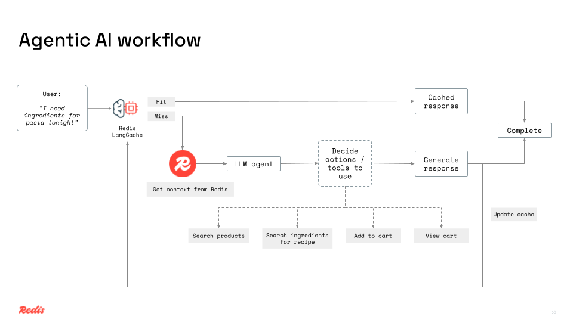

# 🛒 Shopping AI Agent with LangGraph.js and OpenAI

**Redis-powered grocery e-commerce with intelligent shopping assistance.**

This version demonstrates building shopping AI agents using OpenAI's GPT-4 for conversational AI and OpenAI embeddings for vector search.

> 📖 **For complete project information**, see the [main README](../README.md)

---

## Prerequisites

- **Redis**:
  - Use [Redis Cloud](https://redis.io) (no installation required)
- **Redis LangCache API**: [Get LangCache credentials](https://redis.io/langcache/)
- **OpenAI API Key**: [Create an API key](https://platform.openai.com/account/api-keys)
- **Node.js (v18 or higher)**: [Download & Install Node.js](https://nodejs.org/). Alternatively, use a docker-based setup.

## Getting Started

### 1. Configure environment variables

Create a `.env` file in this directory (`openai-version/.env`):

```bash
APP_NAME="Redish"
SERVER_PORT=3000

OPENAI_API_KEY=your_openai_api_key

REDIS_URL=your_redis_connection_string

LANGCACHE_API_KEY="your_langcache_api_key"
LANGCACHE_API_BASE_URL="your_langcache_api_base_url"
LANGCACHE_CACHE_ID="your_langcache_cache_id"

MODEL_NAME="gpt-4o-mini"

# For tracing with Langsmith (optional)
LANGSMITH_TRACING="true"
LANGSMITH_ENDPOINT="your_langsmith_endpoint"
LANGSMITH_API_KEY="your_langsmith_api_key"
LANGSMITH_PROJECT="your_langsmith_project"
```

📝 Make sure to replace these placeholders with your real values before running the app.

### 2. Installation & Setup

#### Option A: Manual Installation

1. Install dependencies:
   ```bash
   npm install
   ```

2. Load sample grocery data:
   ```bash
   npm run load-products
   ```

3. Start the server:
   ```bash
   npm start
   ```

#### Option B: 🐳 Docker Compose

Skip manual setup and run everything using Docker:

```bash
docker compose up
```

To stop the containers:
```bash
docker compose down -v
```

### 3. Access the app

Visit http://localhost:3000 in your browser (or use the port specified in `.env`).

---

## Tech Stack

- **Node.js** + **Express** (Backend API)
- **Redis** (Product store, conversational history, and semantic caching)
- **LangGraph** (AI workflow orchestration)
- **OpenAI API** (GPT-4 for intelligent responses + embeddings)
- **HTML + CSS + Vanilla JS** (Frontend UI)

---

## Architecture Diagrams




---

## Troubleshooting

### Common Issues

1. **OpenAI API Key Issues**
   - Ensure your API key is valid and has sufficient credits
   - Check that `OPENAI_API_KEY` is correctly set in `.env`

2. **Redis Connection Issues**
   - Verify Redis is running: `redis-cli ping`
   - Check `REDIS_URL` format: `redis://localhost:6379`

3. **LangCache Issues**
   - Verify LangCache credentials are correct
   - Check network connectivity to LangCache API

---

## Next Steps

- Explore the [AWS Bedrock version](../aws-bedrock-version/README.md) for enhanced AI capabilities
